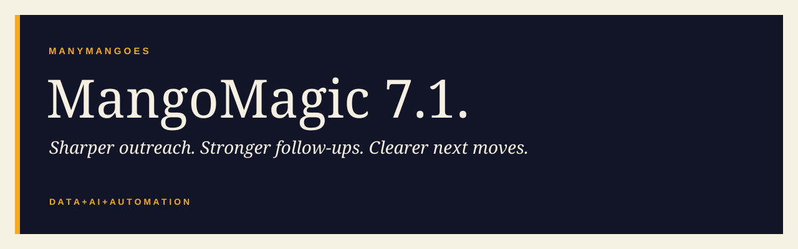

# MangoMagic 7.1.



**Data + AI + Automation.**

[**Open setup →**](https://mango-magic.github.io/mangomagic/) · [Build my assistant](https://mango-magic.github.io/mangomagic/#context) · [Download kit](https://mango-magic.github.io/mangomagic/assets/AI-Operations-Starter.zip)

## Copy. Paste. Go.

Paste into Terminal on your Mac. Creates your workspace, installs MangoMagic and restarts ChatGPT.

```bash
bash -c 'f=$(mktemp) || exit; trap "rm -f \"$f\"" EXIT; curl -fsSL https://raw.githubusercontent.com/mango-magic/mangomagic/main/setup-operations.sh -o "$f" && bash "$f" --with-mangomagic'
```

Then [connect your folder](https://mango-magic.github.io/mangomagic/guide.html#connect) and [build your assistant](https://mango-magic.github.io/mangomagic/#context). Sign-in may be required. [Ollama usage is billed separately](https://ollama.com/pricing).

[Full guide](GUIDE.md) · [Prompts](docs/PROMPTS.md) · [Technical notes](docs/TECHNICAL-NOTES.md)
